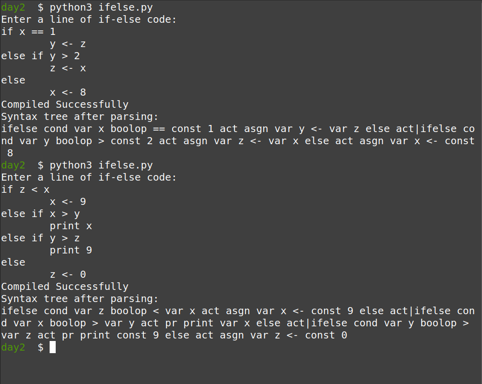

# System Software Lab

System Software Lab sem 7

We had 4 sessions in which we, in the very brief period of time that we were alloted
(and with the very inadequate experience in algorithms that I had), attempted to create:

1. a simple English sentence parser 
2. an if-else parser
3. a relational database management system that implemented basic relational operations:
  - selection
  - projection
  - inner join
  - cross product
  
I worked on the first 2 of the three problems.

Since we did not have any coursework on compiler design, we were given a
working knowledge of how context free grammar works and how a syntax tree can
be generated based on such a grammar, using depth first search strategies. I
have written the two programs based on ths very preliminary understanding.

